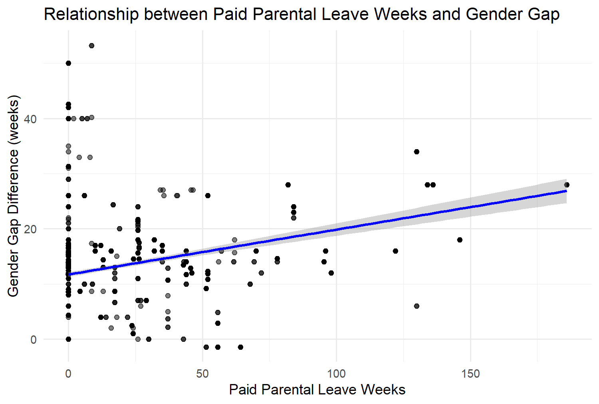

# Parental Leave Policies and Gender Gaps in Paid Leave (OECD Dataset)

This project explores gender disparities in parental leave uptake using national-level policy data（OECD PF2.1 and PF2.5 datasets）. The analysis examines how socioeconomic and policy factors influence male and female participation in parental leave. I calculate both direct and interaction effects of mother- and father-targeted policies using regression and visualization in R.

##  Workflow Overview
R script: [scripts/Cleaning_and_Processing.R](./scripts/Cleaning_and_Processing.R)

### 1. Data Import and Cleaning
- Loaded OECD PF2.1 (maternity, parental) and PF2.5 (paternal, home care) datasets.
- Converted policy columns to numeric, standardized formats, filtered aggregate/invalid rows.

### 2. Variable Construction
- **Dependent variables:**  
  - `GenderGapFRE = Mother_FRE - Father_FRE` (2024 data, ~40 countries)  
  - `gap_diff = Maternity_weeks - Patleave` (1970–2024 PF2.5 time series)
- **Independent variables:**  
  - `Father_quota_share = Father_specific_Parleave / (Mother_FRE + Father_FRE)`  
  - `Mother_payment_ratio = Parental_paid / Parental_protected`  
  - `Mother_index = Maternity_weeks + Parental_paid + Homecare_paid`  
  - `Father_index = Patleave + Father_specific_Parleave_paid`  

### 3. Regression Analyses
- **Baseline regressions:** Single-policy OLS models for gender gap.
- **Interaction model:** `gap_diff ~ Parental_paid * Father_specific_Parleave`
  - Tests whether maternal and paternal policy generosity interact.
- **Index model:** `gap_diff ~ Mother_index * Father_index`
  - Examines how overall maternal vs paternal policy intensity affects the gap.

### 4. Visualization
- Scatter plots showing baseline relationships.
- Interaction heatmap of `Mother_index × Father_index`.
- Color-coded regression plots for maternal and paternal leave interactions.
- All plots saved to `/Outputs` folder.

### Representative Visuals

**1. Gender Gap by Father and Mother Policy Index**  
Shows how the combined intensity of maternal and paternal leave policies relates to the gender gap.  

**2. Baseline Scatter: Father Quota Share vs Gender Gap**  
Visualizes the relationship between father-specific leave as a share of total leave and the gender gap.  

**3. Interaction Heatmap**  
Illustrates how maternal and paternal policy indices jointly affect the gender gap; red = higher gap, blue = lower gap.  

**4. Impact of Father-Specific Leave**  
Shows how father-specific leave modifies the gender gap across levels of maternal paid leave.  

##  Key Findings (Summary)

- **Baseline:** Maternity and paid parental leave strongly increase the gender gap (positive β).  
- **Father-specific leave:** Negatively associated with the gap when scaled by total leave.  
- **Interaction:** When both maternal and paternal supports expand, the marginal gender gap effect flattens — suggesting policy balance reduces inequality.  
- **Model fit:** Index regression explains ~19% of variation across countries.

## Abstract

This analysis explores cross-national variation in parental leave policies to understand how structural design contributes to gender disparities in paid leave. Using OECD PF2.1 and PF2.5 datasets (2010–2024), the study operationalizes gender gap as the difference between total paid leave weeks available to mothers and fathers. Results show that while more generous maternal benefits widen the gap, father-specific quotas and paid paternal entitlements correlate with smaller disparities. Interaction effects between maternal and paternal policy indices indicate that balanced designs—rather than simply extending leave—promote greater parity in policy outcomes.

##  Discussion

The findings highlight the **asymmetry in how welfare states allocate parental leave**, reinforcing traditional caregiving roles when maternal benefits dominate. However, introducing **earmarked father leave** mitigates these structural biases. The diminishing interaction effect implies that equality gains plateau once paternal leave becomes meaningful, aligning with broader gender-equality literature.  
This pattern supports a **structural policy framing of gender inequality**, emphasizing institutional incentives over individual choices.

## Environment & Reproducibility

- **R version:** ≥ 4.2  
- **Libraries:** `dplyr`, `ggplot2`, `readxl`, `purrr`  
- **Reproducibility:** Run scripts sequentially from `/Scripts` to reproduce analyses and figures.  
- **Data:** Raw data in `/Rawd`; cleaned/processed datasets optionally in `/Cleaned`.  
- **Outputs:** Figures and regression tables saved in `/Outputs`.

##  Author

**Zhao Tianxin**  
Independent Research Project — 2025  
Contact: tianxin.zhao.phd@proton.me

